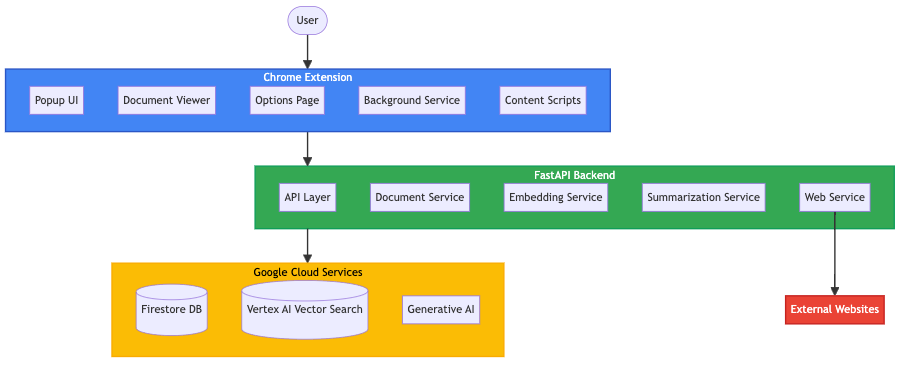

# Marchiver

A personal knowledge archiving and retrieval system, inspired by the Memex, that allows users to save, organize, and intelligently access diverse digital information.


## Documentation

### Architecture Documentation



Comprehensive architecture documentation is available in the [arch](./arch) directory:

- [Architecture Summary](./arch/marchiver_architecture_summary.md): A comprehensive overview of the entire system
- [Block Diagram](./arch/marchiver_architecture.md): High-level components and their relationships
- [Data Flow Diagram](./arch/marchiver_data_flow.md): Detailed illustration of how data moves through the system
- [Component Architecture](./arch/marchiver_component_architecture.md): Internal structure of each major component

See the [Architecture Documentation README](./arch/README.md) for information on viewing and modifying the diagrams.

### Feature Documentation

- [Vector Search Implementation](./backend/VECTOR_SEARCH.md): Details on the implementation of vector search using Google Vertex AI Vector Search

## Overview

Marchiver is a comprehensive system for archiving and retrieving digital content. It allows users to save web pages, documents, and other digital content, and then search and retrieve them using both traditional and semantic search methods.

The system consists of two main components:
1. A backend API built with FastAPI and Python
2. A Chrome extension for easy content saving and retrieval

## Features

- **Data Acquisition & Storage**: Store web pages, documents, images, and other digital content
- **Content Embedding**: Generate vector embeddings for semantic search and similarity analysis
- **Semantic Search**: Search for content based on meaning and context
- **Summarization**: Automatically summarize content using Google Gemini Pro 2.5
- **Data Management**: Edit metadata, track versions, and manage stored content
- **Chrome Extension**: Easily save and search content from your browser

## Installation and Usage

### 1. Prerequisites

This project uses `uv` for Python package management. If you don't have `uv` installed, you can install it following the instructions at [https://github.com/astral-sh/uv](https://github.com/astral-sh/uv).

### 2. Set up the environment
First, create an environment file:
```
cp .env.sample .env
```

Edit the `.env` file to include your Google Cloud credentials. For testing purposes, you can use the dummy credentials:
```
GOOGLE_APPLICATION_CREDENTIALS=dummy-credentials.json
```

#### Where to get environment variable values

The `.env` file requires several configuration values:

1. **Google Cloud Configuration**
   - `GOOGLE_APPLICATION_CREDENTIALS`: Path to your Google Cloud service account key file
     - Create in the [Google Cloud Console](https://console.cloud.google.com/) → IAM & Admin → Service Accounts
     - Create a new service account or use an existing one
     - Create a key (JSON format) and download it
     - Place the file in your project and reference its path
   - `GOOGLE_CLOUD_PROJECT`: Your Google Cloud project ID
     - Found in the Google Cloud Console dashboard
   - `GOOGLE_CLOUD_REGION`: The Google Cloud region to use (e.g., `us-central1`)
   - `GOOGLE_API_KEY`: API key for Google services
     - Create in Google Cloud Console → APIs & Services → Credentials

2. **Vertex AI Configuration**
   - `VERTEX_AI_INDEX_ENDPOINT`: Your Vertex AI index endpoint
   - `VERTEX_AI_INDEX`: Your Vertex AI index name
   - `VERTEX_AI_EMBEDDING_ENDPOINT`: Your Vertex AI embedding endpoint
     - These are created in Google Cloud Console → Vertex AI → Vector Search

3. **Embedding Model Configuration**
   - `EMBEDDING_MODEL`: The embedding model to use (default: `models/embedding-001`)
   - `SUMMARIZATION_MODEL`: The summarization model to use (default: `gemini-pro-2.5`)

4. **Server Configuration**
   - `HOST`: The host to bind the server to (default: `0.0.0.0`)
   - `PORT`: The port to run the server on (default: `8000`)
   - `DEBUG`: Whether to run in debug mode (default: `true`)

For testing with the mock backend (`start_mock_backend.sh`), you don't need real values for these variables as the mock services use simulated responses.

### 3. Start the backend
You have two options:

#### Option A: Run the real backend
This requires valid Google Cloud credentials:
```
./start_backend.sh
```

#### Option B: Run the mock backend (for testing)
This uses mock services and doesn't require real credentials:
```
./start_mock_backend.sh
```

The script will prompt you to install dependencies if needed. The backend server will run on http://localhost:8000 by default.

### 4. Test the frontend
Run the frontend test script:
```
./test_frontend.sh
```

This will open `frontend/test_extension.html` in your default browser, which provides a testing interface for the extension.

### 5. Chrome Extension
For full functionality, you need to load the extension into Chrome:

1. Open Chrome and navigate to `chrome://extensions/`
2. Enable "Developer mode" (toggle in the top-right corner)
3. Click "Load unpacked" and select the `frontend` directory from this project
4. The Marchiver extension should now appear in your Chrome extensions
