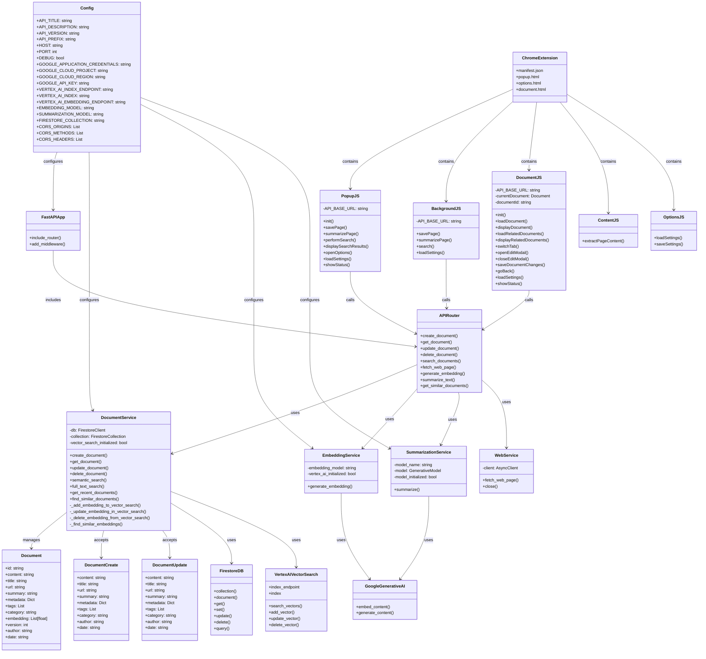

# Marchiver Component Architecture

## Component Details

### Backend Components

#### API Layer
- **FastAPI Application**: Main application entry point
- **API Router**: Defines all API endpoints and routes requests to appropriate services

#### Service Layer
- **Document Service**: Core service for document operations
  - Manages CRUD operations for documents
  - Handles search functionality (both semantic and full-text)
  - Interfaces with Firestore for document storage
  - Interfaces with Vector Search for embedding storage
  
- **Embedding Service**: Generates vector embeddings
  - Uses Google Generative AI for embedding generation
  - Provides fallback mechanisms for embedding generation
  
- **Summarization Service**: Creates document summaries
  - Uses Google Generative AI for text summarization
  - Formats prompts for optimal summarization
  
- **Web Service**: Fetches and processes web content
  - Uses httpx for asynchronous HTTP requests
  - Extracts relevant content from web pages

#### Data Layer
- **Document Models**: Define document structure
  - Base document structure
  - Create/update operation models
  - Validation rules

- **Configuration**: Manages application settings
  - Environment variable handling
  - Service configuration
  - API settings

### Frontend Components

#### User Interface
- **Popup UI**: Main extension interface
  - Search functionality
  - Page saving controls
  - Results display
  
- **Document Viewer**: Displays archived content
  - Content/summary tabs
  - Related documents
  - Edit functionality
  
- **Options Page**: Configuration interface
  - API settings
  - Display preferences
  - Feature toggles

#### Background Processing
- **Background Service Worker**: Handles background tasks
  - API communication
  - Context menu functionality
  - Message handling
  
- **Content Scripts**: Interact with web pages
  - Content extraction
  - Page analysis

#### Storage
- **Chrome Storage**: Manages user preferences
  - API endpoint configuration
  - Feature toggles
  - UI preferences

### External Services

- **Firestore**: Document database
  - Stores document content and metadata
  - Provides basic query capabilities
  
- **Vertex AI Vector Search**: Vector database
  - Stores embeddings for semantic search
  - Performs similarity searches
  
- **Google Generative AI**: AI services
  - Generates embeddings for semantic search
  - Creates document summaries
