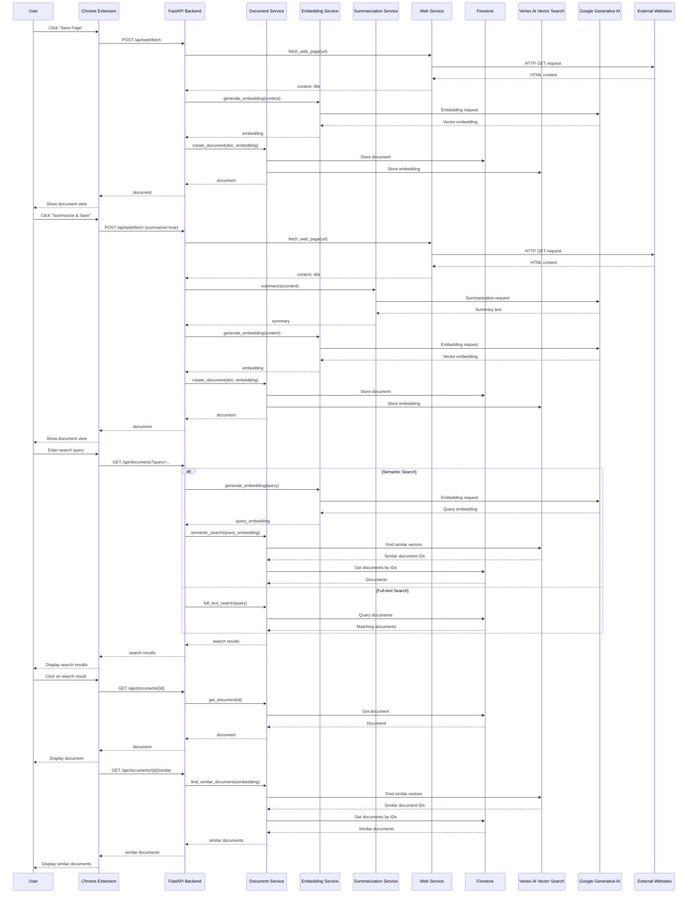

# Marchiver Data Flow Diagram

## Key Data Flows

### 1. Save Page Flow
- User clicks "Save Page" in the extension
- Extension sends the URL to the backend
- Web Service fetches the page content
- Embedding Service generates a vector embedding
- Document Service stores the document and embedding
- Document is displayed to the user

### 2. Summarize Page Flow
- User clicks "Summarize & Save" in the extension
- Extension sends the URL to the backend
- Web Service fetches the page content
- Summarization Service generates a summary
- Embedding Service generates a vector embedding
- Document Service stores the document, summary, and embedding
- Document with summary is displayed to the user

### 3. Search Flow
- User enters a search query in the extension
- For semantic search:
  - Embedding Service generates a vector embedding for the query
  - Document Service finds similar documents using vector search
- For full-text search:
  - Document Service performs a text-based search
- Search results are displayed to the user

### 4. View Document Flow
- User clicks on a search result
- Document Service retrieves the document
- Document is displayed to the user with content and summary
- Similar documents are fetched and displayed

## Data Storage

### Document Structure
- Content: The full text of the document
- Title: Document title
- URL: Source URL (if applicable)
- Summary: AI-generated summary (if available)
- Metadata: Additional information about the document
- Tags: User-defined tags for categorization
- Embedding: Vector representation for semantic search
- Version: Document version for tracking changes

### Storage Systems
- **Firestore**: Stores document content, metadata, and other attributes
- **Vertex AI Vector Search**: Stores vector embeddings for semantic search
