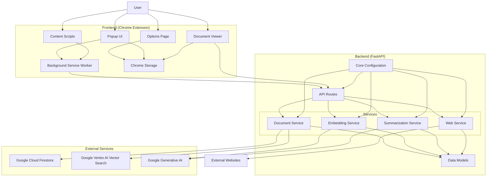

# Marchiver Architecture Block Diagram

## Component Descriptions

### Frontend (Chrome Extension)

- **Popup UI**: Main extension interface for saving pages, searching, and accessing documents
- **Background Service Worker**: Handles background tasks and API communication
- **Content Scripts**: Interacts with web pages for content extraction
- **Document Viewer**: Displays archived documents with content and summaries
- **Options Page**: Configures extension settings
- **Chrome Storage**: Stores user preferences and settings

### Backend (FastAPI)

- **API Routes**: RESTful endpoints for all core functionalities
- **Services**:
  - **Document Service**: Manages document CRUD operations and search
  - **Embedding Service**: Generates vector embeddings for semantic search
  - **Summarization Service**: Creates summaries of documents using AI
  - **Web Service**: Fetches and processes web pages
- **Data Models**: Defines document structure and validation
- **Core Configuration**: Manages environment variables and settings

### External Services

- **Google Cloud Firestore**: Document storage database
- **Google Vertex AI Vector Search**: Vector database for embeddings
- **Google Generative AI**: Provides embedding and summarization capabilities
- **External Websites**: Sources of content to archive

## Data Flow

1. User interacts with the Chrome extension UI
2. Extension communicates with the backend API
3. Backend services process requests:
   - Document Service handles CRUD operations and search
   - Embedding Service generates vector representations
   - Summarization Service creates document summaries
   - Web Service fetches content from external websites
4. Data is stored in Firestore (documents) and Vector Search (embeddings)
5. Results are returned to the frontend for display

## Key Features

- **Data Acquisition & Storage**: Store web pages, documents, and other digital content
- **Content Embedding**: Generate vector embeddings for semantic search
- **Semantic Search**: Search for content based on meaning and context
- **Summarization**: Automatically summarize content using Google Gemini Pro
- **Data Management**: Edit metadata, track versions, and manage stored content
