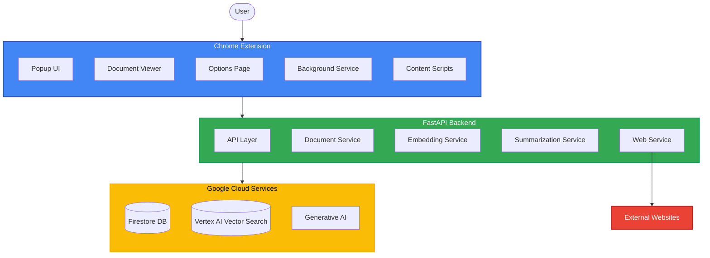

# Marchiver Architecture Diagram

## Key Components

### Chrome Extension
- **Popup UI**: Main interface for searching and saving content
- **Document Viewer**: Displays archived content with tabs for content and summary
- **Options Page**: Configuration interface for user preferences
- **Background Service**: Handles background tasks and API communication
- **Content Scripts**: Extract content from web pages

### FastAPI Backend
- **API Layer**: RESTful endpoints for all core functionalities
- **Document Service**: Manages document operations and search
- **Embedding Service**: Generates vector embeddings for semantic search
- **Summarization Service**: Creates document summaries using AI
- **Web Service**: Fetches and processes web content

### Google Cloud Services
- **Firestore DB**: Document storage database
- **Vertex AI Vector Search**: Vector database for semantic search
- **Generative AI**: Provides embedding and summarization capabilities

### External Websites
- Sources of content to archive
